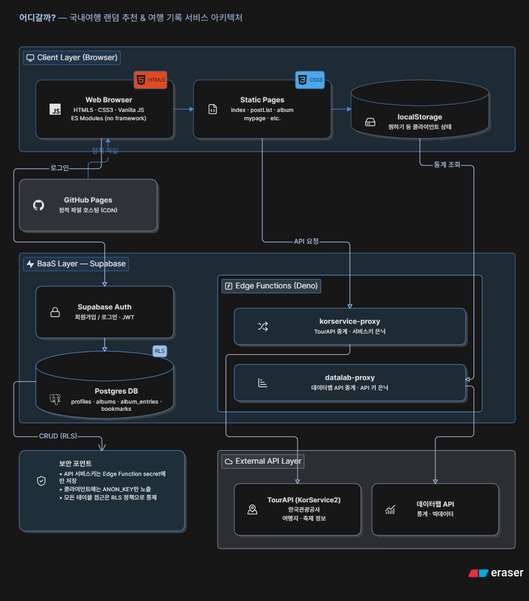

<div align="center">

# 🗺️ 어디갈까?

### 국내여행 랜덤 추천 & 여행 기록 서비스

주사위를 굴려 다음 여행지를 정하고, 지도에서 인기 지역을 살펴보고,<br/>
다녀온 여행을 나만의 앨범으로 기록하는 웹 서비스입니다.

[](.)
[](.)
[](.)
[](.)
[](.)

</div>

---

## 📌 목차

- [소개](#-소개)
- [팀원 소개](#-팀원-소개)
- [주요 기능](#-주요-기능)
- [기술 스택](#️-기술-스택)
- [아키텍처](#-아키텍처)
- [폴더 구조](#-폴더-구조)
- [시작하기](#-시작하기)


---

## 📖 소개

**어디갈까?** 는 어디로 여행을 갈지 고민하는 사람들을 위한 국내여행 랜덤 추천 서비스입니다.
한국관광공사 **TourAPI(KorService2)** 데이터를 기반으로 여행지·축제 정보를 제공하며,
**Supabase**를 통해 로그인, 북마크, 여행 앨범(다이어리) 기능을 지원합니다.

빌드 도구나 프론트엔드 프레임워크 없이 **HTML + CSS + Vanilla JavaScript** 만으로 구현되었습니다.

## 👥 팀원 소개

<div align="center">

|  |  |  |
| :---: | :---: | :---: |
| [pgw2001](https://github.com/pgw2001) | [Luvys99](https://github.com/Luvys99) | [moonishweb-source](https://github.com/moonishweb-source) |

</div>

## ✨ 주요 기능

| 기능 | 설명 |
| --- | --- |
| 🎲 랜덤 여행 뽑기 | 주사위를 굴리면 지도 마커가 순환하다 하나의 여행지에 당첨 |
| 🗺️ 지도 & 인기 지역 | 지역 클릭 시 해당 지역의 여행지 정보와 인기 스팟 확인 |
| 🔍 여행지 · 축제 탐색 | TourAPI 기반 여행지·축제 목록 조회 및 상세 정보 |
| ❤️ 북마크 | 마음에 드는 여행지를 찜하고 마이페이지에서 모아보기 |
| 📔 여행 앨범 | 다녀온 여행을 사진 + 일기 형태로 기록하고 관리 |
| 👤 로그인 / 마이페이지 | Supabase Auth 기반 회원가입·로그인, 개인정보 관리 |

## 🛠️ 기술 스택

| 구분 | 스택 |
| --- | --- |
| Frontend | HTML5, CSS3, JavaScript (Vanilla, ES Modules) |
| Backend / BaaS | Supabase (Auth, Database, Edge Functions) |
| Database | PostgreSQL (Supabase), RLS(Row Level Security) 정책 적용 |
| 외부 API | 한국관광공사 TourAPI(KorService2), 데이터랩 API |
| 배포 | GitHub Pages / 정적 호스팅 |

## 🏗️ 아키텍처

<div align="center">




</div>

> 아키텍처 다이어그램은 추후 추가될 예정입니다.

## 📂 폴더 구조

```
AIBE8_Project1_Team_Yaho/
├── index.html              # 메인 페이지 (랜덤 추천, 지도, 인기 지역)
├── postList.html            # 여행지 · 축제 탐색
├── detail.html               # 여행지 상세 페이지
├── popArea.html               # 인기 지역
├── album.html / album-detail.html / album-edit.html   # 여행 앨범
├── bookmark.html             # 북마크
├── login.html / register.html  # 로그인 · 회원가입
├── mypage.html                # 마이페이지
│
├── css/                      # 페이지별 스타일시트
├── js/
│   ├── api.js                 # TourAPI 연동
│   ├── apiCache.js            # API 응답 캐싱
│   ├── supabaseClient.js      # Supabase 클라이언트 설정
│   ├── authState.js           # 로그인 상태 관리
│   ├── map.js / popArea.js    # 지도 · 인기 지역 로직
│   ├── album.js / bookmark.js # 앨범 · 북마크 로직
│   └── main.js / app.js       # 메인 페이지 렌더링 · 이벤트
│
├── images/                   # 이미지 에셋
├── data/
│   └── bjd-codes.json         # 법정동 코드 데이터
│
├── supabase/
│   ├── schema.sql              # DB 테이블 스키마
│   ├── rls_policies.sql        # RLS 정책
│   └── functions/
│       ├── korservice-proxy/   # TourAPI 프록시 (Edge Function)
│       └── datalab-proxy/      # 데이터랩 API 프록시 (Edge Function)
│
├── apiParam.md                # TourAPI 파라미터 정리 문서
└── README.md
```

## 🚀 시작하기

### 실행 방법

```bash
git clone https://github.com/prgrms-aibe-devcourse/AIBE8_Project1_Team_Yaho.git
cd AIBE8_Project1_Team_Yaho
python3 -m http.server 8777
# http://localhost:8777
```

`index.html` 을 파일로 바로 열어도 동작하지만, `localStorage` 사용 및 Supabase 연동 때문에
로컬 서버 실행을 권장합니다.

### 환경 설정

Supabase 및 TourAPI 관련 민감한 키(서비스키 등)는 코드에 직접 포함되지 않고,
Supabase Edge Function(`supabase/functions`)의 secret으로 관리됩니다.
공개되어도 안전한 `SUPABASE_ANON_KEY`만 `js/config.js`에 포함되어 있습니다.

---

<div align="center">

Made with ❤️ by **Team Yaho** — AIBE8 Project 1

</div>
